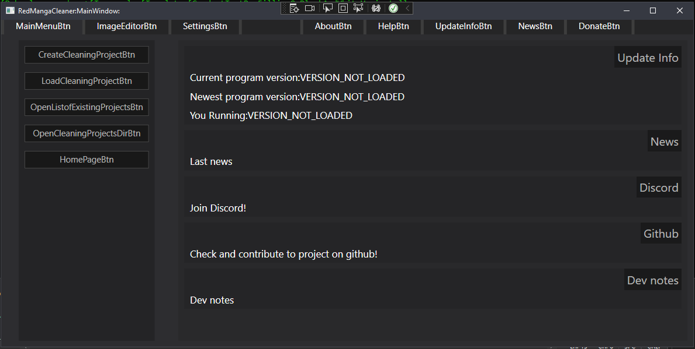
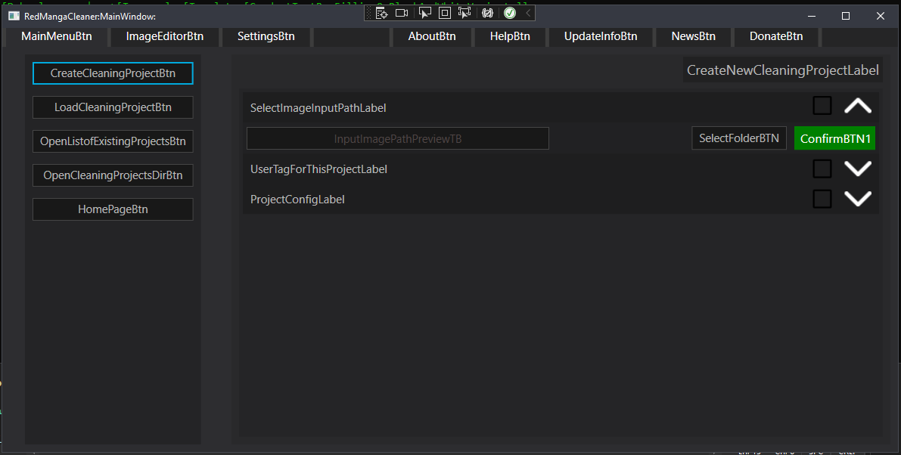

# WIP

Automatic object detection (currently Alturos.Yolo(4) but reworking to YOLOv5)

Simple way to clean manga text bubbles (and ather stuff based on object detection model) (with UI based on WPF)

Features:

1. Object Detection of: manga_text_boxes, sounds, text_without_text_boxes. (Using YOLOv5)
2. Cleaning (Filling internal space of the bouble).
3. Advanced UI (WIP).
4. Project Creator/Loader (Run object detection only for once and after just load result as many time as you want and create multiple variants).
5. Update manager.
6. Language Manager.
